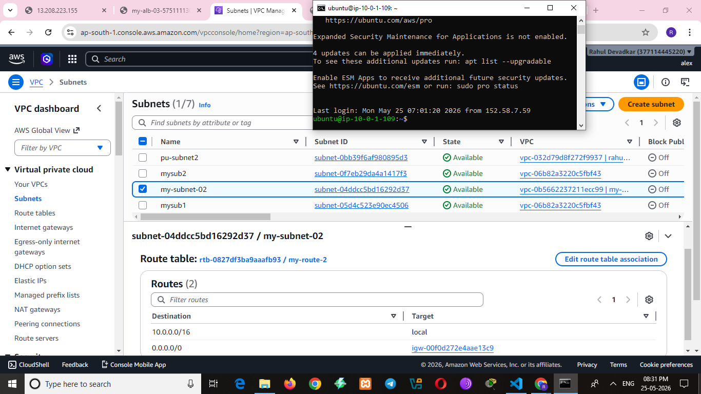
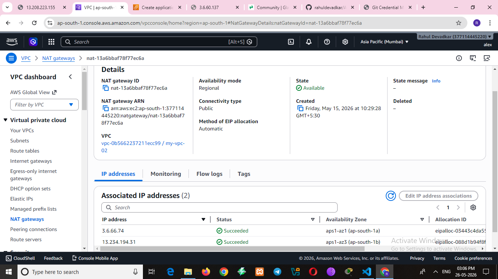

# 🚀 AWS NAT Gateway Project

## 📌 Project Overview
This project demonstrates secure AWS VPC architecture using public and private subnets with a NAT Gateway.

The main goal of this project was to understand:
- AWS networking
- Public and private subnet communication
- Internet access through NAT Gateway
- Route table configuration
- Secure cloud architecture

---

## 🏗️ Architecture
User → Internet Gateway → Public Subnet → NAT Gateway → Private Subnet

---

## 🛠️ Services Used
- Amazon VPC
- Public Subnet
- Private Subnet
- Internet Gateway
- NAT Gateway
- Route Tables
- EC2 Instances
- Security Groups

---

## ⚙️ Project Steps
1. Created custom VPC
2. Created public and private subnets
3. Attached Internet Gateway
4. Created NAT Gateway in public subnet
5. Configured route tables
6. Launched EC2 instances
7. Verified internet access from private EC2

---

## 🔐 Key Learning
- Difference between public and private subnet
- Working of NAT Gateway
- Route table configuration
- Secure AWS networking
- Bastion Host concept

---

## 📷 Screenshots

### VPC Architecture

### NAT Gateway

### Public Route Table

### Private Route Table

### Private EC2 Instance

### SSH Access public subnet

### Private EC2 Internet Access

---

## 📚 Conclusion
This project helped me gain hands-on experience with AWS networking and secure cloud infrastructure design.